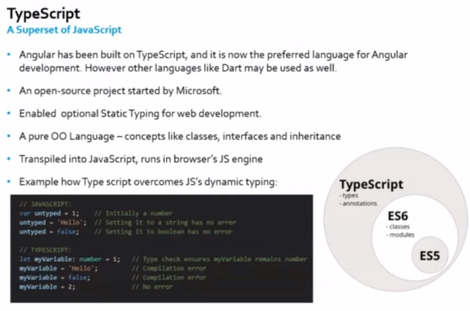
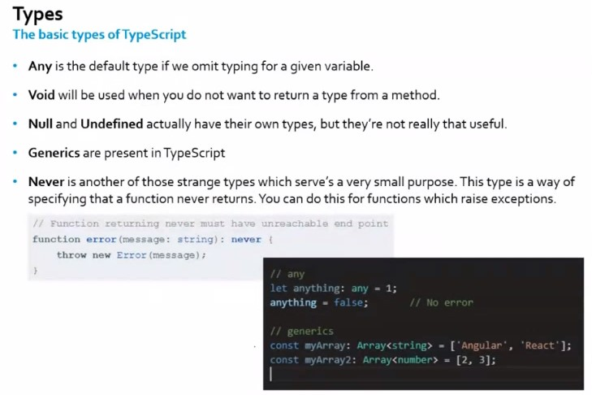
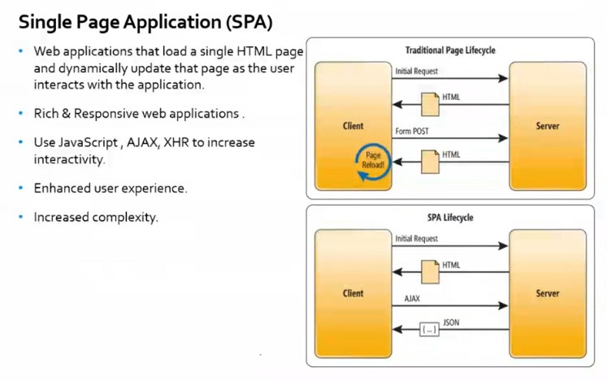
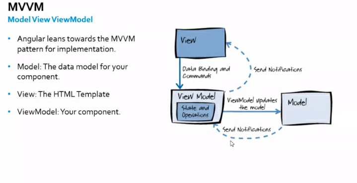
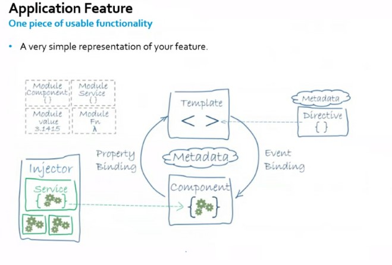
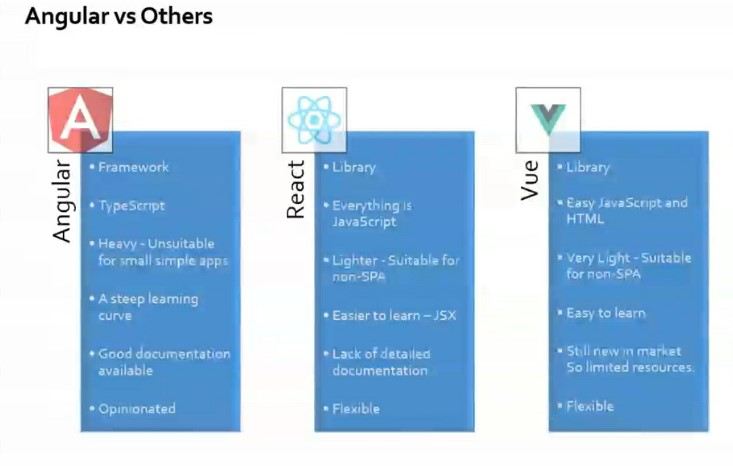
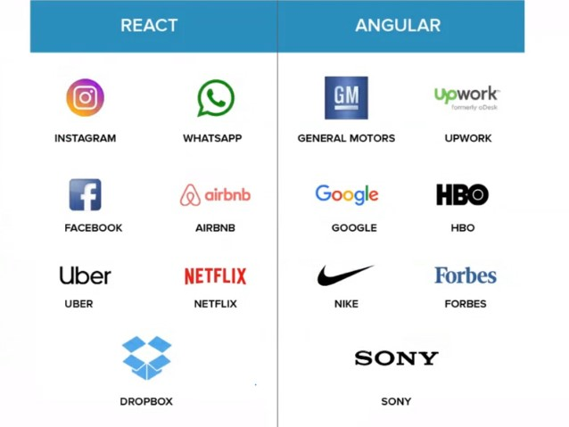
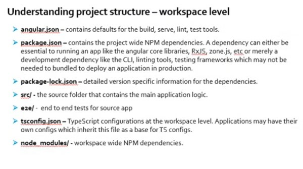

===============================================
training #2 @ ms
===============================================

Angular Blended Training 

Agenda
-----------
.. list-table:: 
    :align: left

    * - day #
      - topic
  
    * - day #1
      - Introduction to Typescript, Angular
  
    * - day #2
      - Basic Setup
      
    * - day #3
      - Interactions amongst: Components [parent/child, orphan], Services, Dependency Injection / Observables
      
    * - day #4
      - Routing

    * - day #5
      - Routing, Pipes, Forms

    * - day #6
      - Unit & Automation Testing

Day #1
-----------

.. code-block:: bash 
  
  #################################################################################################

.. code-block:: bash 
  
  #################################################################################################

.. image:: img/d1-2.jpg

.. code-block:: bash 
  
  #################################################################################################
  

.. code-block:: bash 
  
  #################################################################################################
  
.. image:: img/d1-4.jpg

.. code-block:: bash 
  
  #################################################################################################
  
.. image:: img/d1-5.jpg

.. code-block:: bash 
  
  #################################################################################################
  

.. code-block:: bash 
  
  #################################################################################################
  

.. code-block:: bash 
  
  #################################################################################################
  

.. code-block:: bash 
  
  #################################################################################################
  

.. code-block:: bash 
  
  #################################################################################################
  

Day #2
-----------

.. code-block:: bash 
  
  #################################################################################################
  
.. image:: img/d2-1.jpg

.. code-block:: bash 
  
  #################################################################################################
.. image:: img/d2-2.jpg

.. code-block:: bash 
  
  #################################################################################################

.. code-block:: bash 
  
  #################################################################################################

Day #3
--------------

**Component Interations**

.. code-block:: bash 
  
  #################################################################################################

#. passing data from "child" component to a "sub-child" component using ``@Input()`` decorator
#. receiving data in "parent" component from "child" component using ``@Output()`` decorator and ``EventEmitter()``
#. receiving data in "parent" component from "child" component using ``@ViewChild`` decorator and ``ngAfterViewInit()`` lifecycle

.. code-block:: bash 
  
  #################################################################################################

**Services**

+ communicating / transfer data between components where parent-child relation is not there
+ form of injectable class
+ responsible to-do something in a particular thing
+ services: classes where functionality / business functionality to be implemented
+ ``@Injectable``:  
      + defines a service is injectable into other Components
      + components inject Services
      + modules a way to restrict the access to the services 
      + restrict service usage to modules:
          + remove ``providedIn: 'root'`` from ``***services.ts`` and include in ``app.module.ts`` under ``providers[ DemoChildService ]``
+ injection happens via ``constructors``

**Services cons & how to handle**

+ services: ``cons``: if a value is updated post 1st load, then the same is not reflected across all it's usages, but only where it's explicitly resetted
+ using ``BehaviorSubject`` of ``RxJS``
    + ``Observable`` can be created
    + to which everyone will be subscribed
    + and any change to the original obj
    + all the listeners will take the latest value

.. code-block:: bash 
  
  #################################################################################################

**Dependency Injection**

+ once the proj reaches enterprise level
+ and lot of components are created (~20 components) in our application
+ and sharing data between them using the basic: ``@ViewChild`` or ``@Input`` decorator or ``EventEmitter`` will be very difficult
+ hence, what is recommended at the very basic is to use ``service`` to share data
+ ``angular`` has heavily used ``DI`` while writing
+ ``DI`` = instead of a component creating its own dependency, it includes that dependency whenever required **

.. code-block:: bash 
  
  ################################################################################################# 

Day #4
-----------
